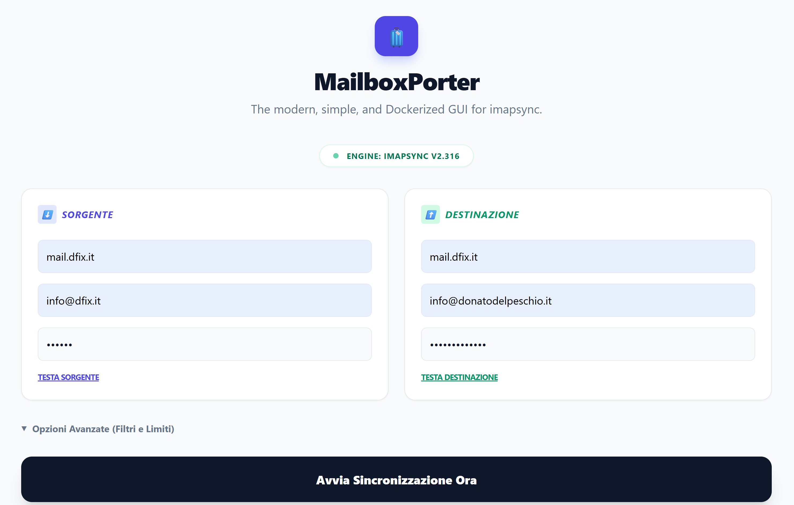
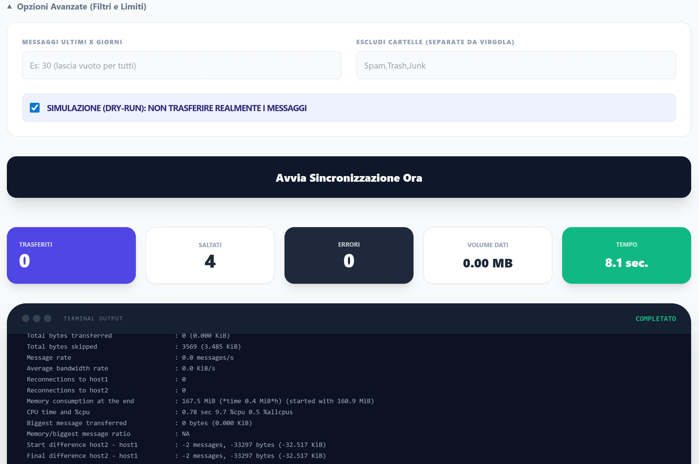

# 🧳 MailboxPorter
**The modern, simple, and Dockerized GUI for imapsync.**
___
MailboxPorter nasce dalla necessità di rendere la migrazione delle email un processo visivo, intuitivo e privo di stress. Sfrutta la potenza di `imapsync` con un'interfaccia web moderna basata su PHP 8.3 e Tailwind CSS.

## 🚀 Caratteristiche
- 🐳 **Pronto all'uso con Docker**: Nessuna installazione complessa di Perl o dipendenze.
- 🎨 **Interfaccia Moderna**: Design pulito e responsive.
- ⚡ **Real-time Feedback**: Monitora il progresso della sincronizzazione live.
- 🔒 **Sicuro**: Tutto gira localmente sul tuo server o PC.




## 🛠️ Installazione Rapida

Assicurati di avere [Docker](https://www.docker.com/) installato, quindi clona il repository:

```bash
git clone [https://github.com/donatodelpeschio/MailboxPorter.git](https://github.com/donatodelpeschio/MailboxPorter.git)
cd MailboxPorter
docker-compose up -d
```
L'applicazione sarà disponibile su: http://localhost:8080

## 🏗️ Architettura

- Backend: PHP 8.x + imapsync (Perl engine)

- Frontend: Alpine.js (Reattività) + Tailwind CSS (Design)

- Icons: Emoji-based favicon & Lucide icons


___

🤝 Contribuire
Le pull request sono benvenute! Per modifiche importanti, apri prima un'issue per discutere cosa vorresti cambiare.

___
☕ Supporta il progetto
Se questo tool ti ha risparmiato ore di lavoro migrando caselle email, [offrimi un caffè](https://paypal.me/mailboxporter)!

Prodotto con ❤️ da Donato Del Peschio




___
